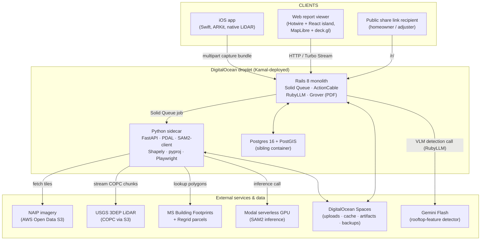

# Architecture — RoofTrace

**Status:** agreed (v1) · **Last updated:** 2026-05-27
**Brief:** [`../BRIEF.md`](../BRIEF.md) — Precision Roof Measurement &
Complexity Mapping for CompanyCam (Silver tier, 4-day window)
**Research:** [RESEARCH.md](./RESEARCH.md) · **Company:** [COMPANY.md](./COMPANY.md) · **ADRs:** [docs/adrs/](./adrs/)
**Interactive diagram:** [architecture-diagram.html](./architecture-diagram.html) — isometric overview + data-flow + calls views (open in a browser)

---

## Executive summary

**What we're building.** RoofTrace is a roof-measurement and
complexity-mapping system for the contractor trades, designed for
CompanyCam. A contractor types in an address and within ~90 seconds
receives a roof report — total area (±1–3% where public LiDAR exists,
honest ±10% fallback elsewhere), per-facet pitch and area, detected
rooftop features (vents, chimneys, dormers, skylights, sat-dishes), an
interactive 3D viewer, a claim-defensibility PDF, and a shareable
public link. Contractors with a Pro iPhone can optionally augment the
measurement with a guided walk-around capture (photos + ARKit world-
mesh + LiDAR depth + GPS+IMU), which the backend fuses into the
geometry — and produces *server-side AR overlays* of the measurement
back onto those photos.

**The headline architectural approach.** Satellite + public LiDAR
fusion: NAIP imagery + USGS 3DEP LiDAR streamed via COPC, cropped to a
Microsoft Building Footprints + Regrid parcel boundary, geometry from
RANSAC plane fitting on the LiDAR points, outline refinement via SAM2,
rooftop-feature detection via a VLM (Gemini Flash). Backend is a Rails
8 monolith with a Python sidecar carrying the geospatial numerics;
both deploy as Docker containers to a single DigitalOcean droplet via
Kamal, with SAM2 inference on Modal (serverless GPU) and blob storage
on DigitalOcean Spaces. Mobile is a thin native iOS app — a smart
camera that uploads the full sensor bundle; all fusion math happens
server-side.

**The 3 most consequential decisions.**

- **[ADR-001](./adrs/ADR-001-geometry-architecture-sat-lidar-fusion.md)
  — satellite + public LiDAR fusion with an honest no-LiDAR
  fallback.** Inverts the usual generative-AI pitch: we don't infer a
  measurement, we measure (where LiDAR exists), and we tell the user
  which mode they're in.
- **[ADR-008](./adrs/ADR-008-backend-rails-with-python-sidecar.md) —
  Rails monolith with a Python sidecar at the geospatial-pipeline
  boundary.** Stack-fit with CompanyCam (Ruby + RubyLLM for the LLM
  feature) without losing access to PDAL/GDAL/Shapely. The boundary is
  the API of the geometric pipeline, not the org chart.
- **[ADR-007](./adrs/ADR-007-mobile-capture-thin-ios-app.md) — iOS
  app as a smart camera, not a smart device.** Captures the richest
  possible sensor bundle (ARKit world-mesh + depth + photos +
  GPS+IMU), uploads to the backend, runs no on-device
  reconstruction. Pairs with **[ADR-019](./adrs/ADR-019-stretch-ar-overlay-on-captured-photo.md)**:
  AR as an *output* of the pipeline (overlay facets on captured
  photos), not an *input* — the visual wow moment without the
  live-AR scope cost.

**Stretch features we're committing to.** A
**claim-defensibility PDF** (ADR-018) that looks like an adjuster-
filable insurance supplement (methodology footnote, GPS-verified
visit timestamps, evidence photos, signature line) — built on top of
the PDF we ship anyway. And **server-side AR overlay** (ADR-019)
projecting LiDAR-derived facets back onto a captured photo, framing
the iOS photo corpus as a measurement medium.

**The key risks.** (1) USGS 3DEP coverage is uneven — handled by an
upfront WESM coverage check and a graceful fallback path that the UI
names rather than hides. (2) Geospatial plumbing (address → LAZ
tile is ~5 hops through CRSes and indexes) — pre-budgeted as Day 1.
(3) Sub-5-min latency budget with a Modal cold-start — mitigated by
warm-up calls and a local-CPU SAM2 fallback. (4) Demo logistics — 3–5
hand-picked demo addresses, validation harness publishes the test
set, "type any address" is a clearly-labeled live-mode add-on.

---

## System overview

### Component diagram



The droplet hosts Rails, the Python sidecar, and Postgres as three
containers managed by Kamal. Rails owns user-facing concerns (HTTP
API, auth, file uploads via ActiveStorage, async job orchestration via
Solid Queue, real-time updates via ActionCable, PDF composition via
Grover, the VLM call via RubyLLM). The Python sidecar is the
geospatial numerics service — PDAL for LiDAR, Shapely/pyproj for
polygon arithmetic, SAM2 (via Modal) for outline refinement, RANSAC
for plane fitting, ICP for aligning ARKit meshes to the public-LiDAR
point cloud, Playwright for rendering map/3D screenshots. The clients
(iOS app, web viewer, public share links) all talk to Rails; the
sidecar is internal-only. External services (NAIP, USGS 3DEP, MS
Footprints + Regrid, Gemini Flash, Modal) are consumed by whichever
service owns that responsibility — Rails for the VLM call, sidecar
for all geospatial data.

### Data flow: address-only measurement (happy path)

```mermaid
sequenceDiagram
  autonumber
  actor Contractor
  participant Rails
  participant Postgres as PG (PostGIS)
  participant Sidecar
  participant Modal
  participant Gemini
  participant NAIP
  participant LiDAR as USGS 3DEP

  Contractor->>Rails: POST /jobs { address }
  Rails->>Rails: create Job, share_token, capture_token
  Rails->>Postgres: persist Job (pending)
  Rails-->>Contractor: 201 { job_id } (Turbo Stream opens)
  Rails->>Rails: enqueue GeometryJob (Solid Queue)

  rect rgba(255,140,0,0.08)
    note over Rails,Sidecar: GeometryJob runs in a Solid Queue worker
    Rails->>Rails: geocode address (Nominatim)
    Rails->>Postgres: lookup/insert cached geocode
    Rails->>Sidecar: POST /pipeline/run { job_id, lat, lng, ... }

    Sidecar->>NAIP: fetch crop of nadir tile
    Sidecar->>LiDAR: WESM coverage check
    alt LiDAR available
      Sidecar->>LiDAR: PDAL pipeline → COPC crop → class-6 building points
      Sidecar->>Modal: SAM2 outline refinement (warm)
      Sidecar->>Sidecar: RANSAC plane fit → facets w/ pitch
    else LiDAR missing (fallback)
      Sidecar->>Modal: SAM2 outline refinement
      Sidecar->>Sidecar: planimetric area / cos(pitch) — pitch inferred
    end
    Sidecar-->>Rails: { measurement, facets, source, confidence, warnings }

    Rails->>Gemini: VLM feature detection (RubyLLM) on cropped tile
    Gemini-->>Rails: detections (verified vs pending)
    Rails->>Postgres: persist Measurement, Facets, Features
  end

  Rails-->>Contractor: Turbo Stream: status → "ready", redirect to /jobs/:id
  Contractor->>Rails: GET /jobs/:id (Hotwire page; React viewer mounts)
  Rails->>Contractor: HTML + React bundle + JSON
  Contractor->>Rails: GET /reports/:id.pdf (Grover composes; sidecar renders map image)
  Rails->>Sidecar: POST /pipeline/render-images
  Sidecar-->>Rails: { map_image_url, oblique_image_url }
  Rails-->>Contractor: report.pdf
```

The full happy path is bounded by external-service latency: NAIP tile
fetch and COPC stream from the AWS open-data buckets dominate
(~10–30s each); SAM2 inference on Modal warm is ~1s; VLM call is
~3–5s; everything else is sub-second. Total wall-clock target is
well under the brief's 5-minute budget — typically ~60–90 seconds on
the happy path with warm caches.

### Data flow: with iOS capture session (additive)

```mermaid
sequenceDiagram
  autonumber
  actor Crew
  participant iOS
  participant Rails
  participant Sidecar
  participant Spaces

  Crew->>Rails: (web) create job for address, share capture URL
  Rails-->>Crew: { capture_token, job_id }
  Crew->>iOS: open app, enter capture_token
  iOS->>iOS: guided walk-around (8 prompts)
  iOS->>iOS: ARKit world-mesh + per-frame depth + GPS + IMU
  iOS->>Rails: POST /api/v1/capture-sessions/:job_id (multipart)
  Rails->>Spaces: ActiveStorage uploads
  Rails->>Rails: enqueue FusionJob

  rect rgba(0,128,0,0.08)
    note over Rails,Sidecar: FusionJob runs after GeometryJob completes
    Rails->>Sidecar: POST /pipeline/fuse-capture { job_id, session_id }
    Sidecar->>Sidecar: ICP-align ARKit mesh to public-LiDAR points
    Sidecar->>Sidecar: merge into unified mesh; re-run plane fit
    Sidecar-->>Rails: updated measurement (source = lidar+device+imagery)
  end

  Rails->>Rails: enqueue ProjectionJob (ADR-019 stretch)
  Rails->>Sidecar: POST /pipeline/project-photo (per captured photo)
  Sidecar->>Sidecar: pinhole projection + z-buffer occlusion
  Sidecar-->>Rails: { composite_image_url, overlay_svg_url }
  Rails-->>Crew: Turbo Stream: "On-Site Visualization ready"
```

When an iOS session arrives, the backend runs two follow-on jobs in
sequence. **FusionJob** ICP-aligns the device's ARKit mesh to the
public-LiDAR point cloud, merging the device-captured geometry
(especially valuable for tree-occluded or LiDAR-gap eaves) into the
unified mesh, then re-runs plane fitting on the combined cloud. The
measurement's `source` field upgrades to `lidar+device+imagery`,
typically with a higher confidence score. **ProjectionJob** (the
ADR-019 stretch) projects each refined facet back onto each captured
photo using pinhole-camera math and z-buffer occlusion, producing
composited "AR overlay" images that appear in the web report and the
PDF.

---

## Decision index

| ADR | Decision | Status | Stretch |
|-----|----------|--------|---------|
| [ADR-001](./adrs/ADR-001-geometry-architecture-sat-lidar-fusion.md) | Satellite + public LiDAR fusion as the headline geometry architecture (with honest no-LiDAR fallback) | Accepted | no |
| [ADR-002](./adrs/ADR-002-imagery-providers-naip-mapbox.md) | NAIP (AWS Open Data) for measurement-input imagery + Mapbox Satellite for UI basemap | Accepted | no |
| [ADR-003](./adrs/ADR-003-lidar-source-usgs-3dep-copc.md) | USGS 3DEP LiDAR streamed via COPC + PDAL, indexed by WESM | Accepted | no |
| [ADR-004](./adrs/ADR-004-footprint-source-ms-building-footprints-regrid.md) | MS Building Footprints + Regrid free tier for building/parcel polygons | Accepted | no |
| [ADR-005](./adrs/ADR-005-roof-outline-sam2-with-prior.md) | SAM2 zero-shot with MS footprint as mask prior for outline refinement | Accepted | no |
| [ADR-006](./adrs/ADR-006-feature-detection-vlm-primary.md) | VLM as v1 starting implementation (behind a swappable interface) + light verification pass for rooftop-feature detection; production model chosen by evaluation | Accepted | no |
| [ADR-007](./adrs/ADR-007-mobile-capture-thin-ios-app.md) | Thin native iOS app (ARKit world-mesh + depth + photos + GPS + IMU), backend does all fusion | Accepted | no |
| [ADR-008](./adrs/ADR-008-backend-rails-with-python-sidecar.md) | Rails 8 monolith + Python sidecar at the geospatial-pipeline boundary | Accepted | no |
| [ADR-009](./adrs/ADR-009-persistence-postgres-postgis-on-droplet.md) | Postgres 16 + PostGIS as a sibling container on the same droplet | Accepted | no |
| [ADR-010](./adrs/ADR-010-blob-storage-do-spaces.md) | DigitalOcean Spaces (S3-compatible) for all blob storage | Accepted | no |
| [ADR-011](./adrs/ADR-011-deploy-kamal-do-droplet.md) | Deploy as Docker containers to a DigitalOcean droplet via Kamal | Accepted | no |
| [ADR-012](./adrs/ADR-012-gpu-inference-modal.md) | Modal for serverless GPU inference (SAM2), with local-CPU fallback | Accepted | no |
| [ADR-013](./adrs/ADR-013-web-stack-hotwire-react-island.md) | Hotwire pages with a React island for the viewer; MapLibre + deck.gl | Accepted | no |
| [ADR-014](./adrs/ADR-014-pdf-grover-with-prerendered-map-images.md) | PDF composed in Rails with Grover using sidecar-rendered map images | Accepted | no |
| [ADR-015](./adrs/ADR-015-json-export-schema-versioned.md) | JSON export treated as a versioned public contract (JSON Schema, semver) | Accepted | no |
| [ADR-016](./adrs/ADR-016-auth-dev-login-plus-share-tokens.md) | Single dev login on submit + opaque public-share tokens on reports | Accepted | no |
| [ADR-017](./adrs/ADR-017-accuracy-validation-harness.md) | Validation: 15 LiDAR-covered + 3 EagleView/tape controls; MAPE + P90 | Accepted | no |
| [ADR-018](./adrs/ADR-018-stretch-insurance-claim-pdf.md) | Stretch: the PDF is a claim-defensibility artifact (methodology, visit timestamps, evidence photos) | Accepted | **yes** |
| [ADR-019](./adrs/ADR-019-stretch-ar-overlay-on-captured-photo.md) | Stretch: server-side AR overlay projecting facets onto captured iOS photos | Accepted | **yes** |

---

## Stretch features

### Built in v1

- **[ADR-018](./adrs/ADR-018-stretch-insurance-claim-pdf.md) —
  Insurance-claim-ready PDF.** The PDF report ships as an adjuster-
  filable insurance supplement, not a generic measurement summary.
  Adds methodology footnote (named data sources + acquisition
  dates), GPS-verified site-visit block (when an iOS session
  exists), 2–4 evidence photos, signature line, attribution footer,
  construction-document chrome. *Why this CTO cares:* CompanyCam's
  contractors already use the platform's photos for insurance
  documentation; the measurement plus the visit-verified evidence
  pair makes the claim package stronger than what EagleView can
  produce alone. *Depends on:* [ADR-014](./adrs/ADR-014-pdf-grover-with-prerendered-map-images.md)
  (PDF rendering), [ADR-007](./adrs/ADR-007-mobile-capture-thin-ios-app.md)
  (iOS visit evidence).

- **[ADR-019](./adrs/ADR-019-stretch-ar-overlay-on-captured-photo.md) —
  Server-side AR overlay on captured iOS photos.** Projects the
  pipeline's roof facets back onto a photo the crew already took
  during the guided walk-around, using pinhole-camera math + z-buffer
  occlusion against the ARKit world-mesh. *Why this CTO cares:*
  the demo's visual-wow moment, and the architectural framing that
  turns CompanyCam's existing photo archive into a spatial substrate
  — facets today, damage callouts (per their project-2 brief)
  tomorrow. AR as **output** of the server pipeline rather than
  **input** to a live AR UX is the inversion that fits the 4-day
  budget. *Depends on:* [ADR-007](./adrs/ADR-007-mobile-capture-thin-ios-app.md)
  (iOS captures world-mesh + photo + pose data),
  [ADR-001](./adrs/ADR-001-geometry-architecture-sat-lidar-fusion.md)
  (facet geometry to project).

### Roadmap (writeup, not built)

These are not committed v1 deliverables but are flagged in the writeup
to show the project's understanding of CompanyCam's full strategic
surface:

- **Integration into CompanyCam Reports** — render the measurement as
  a section in the contractor's existing branded Report template.
  Frames RoofTrace as a native CompanyCam feature, not an external
  tool.
- **Auto-trigger on first jobsite photo at an address** — background-
  fetch the satellite/LiDAR pipeline the moment a CompanyCam crew
  arrives at a new address. By the time the crew is back in the
  truck, the measurement is waiting. Native workflow integration.
- **Damage-detection cross-pollination** (CompanyCam's project-2
  brief) — roof facet geometry + per-photo damage detections →
  automatic "damaged shingles per facet" counts mapped to Xactimate
  line items. The unified pitch across briefs 01 and 02.
- **Voice-guided fallback capture** (CompanyCam's project-3 brief) —
  when satellite/LiDAR coverage is poor, fall back to a voice-prompted
  mobile capture flow using the same capture habit the crew already
  has. Cross-project narrative.

---

## Non-goals

- **Compete with EagleView's full-fidelity human-reviewed reports.**
  We are explicitly bundling a "good enough" measurement to recapture
  the $25–$90 per-roof spend leaking out of CompanyCam contractors;
  not displacing EagleView's 10-year imagery-fleet + human-in-the-loop
  moat. The writeup states this honestly.
- **Nationwide ±3% accuracy.** ±3% is the achievable accuracy *where
  3DEP LiDAR exists at adequate density*; the no-LiDAR fallback path
  reports honest ±10% and the UI tells the user which mode they're in.
  Hiding the gap would be the wrong defense; naming it is the right
  one.
- **Live AR UX in the iOS capture flow.** ADR-007 cuts live AR for
  capture cost reasons. AR-as-output (ADR-019) replaces it as the
  visual-wow surface.
- **Android.** iOS-only mobile for v1; the depth/mesh story doesn't
  exist on the Android installed base. Documented; not hidden.
- **Multi-tenancy / user accounts / billing.** ADR-016 ships
  dev-login + public-share tokens; full account management is a
  post-v1 problem.
- **Auto-scaling / HA.** ADR-011 ships single-droplet; the migration
  path (second droplet + DO Load Balancer + DO Managed Postgres) is
  documented but not built.
- **Fine-tuned ML models.** ADR-006 chooses VLM-as-detector
  explicitly over fine-tuned YOLO for the 4-day budget; the fine-tune
  path is the "production accuracy upgrade" in the writeup roadmap.
- **A Python ML/AI tier separate from the Python geospatial sidecar.**
  ADR-008 keeps the LLM call in Rails (RubyLLM) because that's
  CompanyCam-stack-aligned; the Python sidecar is geospatial-numerics
  only. The split is deliberate.

---

## Open questions

- **Exact CompanyCam brand assets / palette.** COMPANY.md has the
  visual direction but exact brand hex / typography needs verification
  from companycam.com before the demo. Resolved by: 30-minute brand-
  asset audit pre-demo; RoofTrace uses a near-but-distinct mark to
  avoid mimicry concerns.
- **Pro iPhone hardware for development & demo.** ADR-007 assumes
  access; if none available, fixture-session bundles back the demo.
  Resolved by: confirm hardware availability or commit to fixture-
  driven demo path Day 1.
- **EagleView ground-truth report purchase.** ADR-017 budgets ~$80 for
  one Premium report on a known address. Resolved by: purchase before
  Day 3 so it's in hand for validation harness runs.
- **Modal cold-start behavior under demo conditions.** First-of-day
  invocation is ~30s; subsequent are warm. Resolved by: pre-demo
  warm-up call, plus the local-CPU SAM2 fallback if Modal flakes.
- **CTO / VP Engineering name at CompanyCam.** COMPANY.md TODO; must
  be resolved by 30-min LinkedIn audit before any direct
  conversation.
- **Caddy vs Kamal-bundled Traefik on the host.** ADR-011 names the
  conflict and accepts either path; pick at deploy time when wiring
  the subdomain routing.
- **JSON export schema fields against industry conventions.** ADR-015
  proposes a schema; verify field naming against a sample Xactimate
  or EagleView JSON output before locking v1.0.0.
