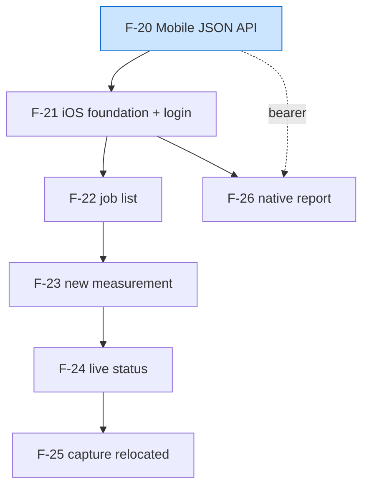

# BUILD-PLAN — iOS full-featured app (ios-full-app)

**Iteration slug:** `ios-full-app` · **Features:** F-20 → F-26 (7) · **Status:** Approved · **Planned:** 2026-05-31 · **Approved:** 2026-05-31

> This is the orchestration index that `kmaz-build-iteration` consumes. It freezes the
> dependency order, the model tiers, and the **shared contract** every feature builds
> against. The per-feature checkbox plans live in each `docs/features/NN-*.md`.
> **Do not start the build until Status is "Approved."**

## What this iteration is

Make the native iOS app **full-featured** — a contractor does everything the web does,
natively: sign in, list jobs, start a job (MapKit address entry), watch the pipeline run
live, optionally do the in-app LiDAR capture, and view the finished report natively. One
**backend feature** (F-20, the mobile JSON API) plus six **iOS features** (F-21–F-26).

v1 (F-01–F-19) is shipped and deployed. All dependencies of this iteration exist in code
(verified during scope): F-03 auth (`SessionsController`, `has_secure_token`,
`require_demo_login`), F-10 orchestrator + the `Job` status enum, F-14
`JobExportSerializer` + `Api::V1::JsonExportsController`, F-15 the iOS Xcode project +
`gen_pbxproj.py` + `CaptureSessionState` + `MultipartUploader` + `TokenValidator`.

## Dependency order & model tiers

The genuinely-serial spine is **F-20 → F-21 → F-22 → F-23 → F-24 → F-25**. F-20 (backend)
and F-21 (iOS foundation) build **concurrently** — F-21's screens run against a
`FakeAPIClient` until F-20 lands. F-26 (native report) depends only on F-21 + the
already-frozen `json_export.schema.json`, so it builds early, in parallel with the
F-22→F-25 chain.

| Order | Feature | Hard deps (within iteration) | Concurrency | Builder tier | Notes |
|---|---|---|---|---|---|
| 0a | **F-20** Mobile JSON API | — (deps are shipped) | ∥ F-21 | Sonnet | The contract source. Route-collision is the load-bearing risk. |
| 0b | **F-21** iOS foundation + login | — (FakeAPIClient until F-20) | ∥ F-20 | Sonnet | Largest feature; glob pbxproj **first**. Every screen inherits this. |
| 1 | **F-22** iOS job list / home | F-21 | ∥ F-26 | Sonnet | Owns `StatusIndicator` + the `route(for:)` rule. |
| 2 | **F-23** iOS new measurement | F-21, F-22 | ∥ F-26 | Sonnet | Produces `CaptureHandoff`. |
| 3 | **F-24** iOS live status | F-21, F-23 | ∥ F-26 | Sonnet | Owns the poll-loop contract; consumes `StatusIndicator`. |
| 4 | **F-25** iOS capture relocated | F-21, F-24 | ∥ F-26 | Sonnet | Move + re-seam + restyle; **wire contract unchanged**. |
| — | **F-26** iOS native report viewer | F-21 (+ F-20 bearer) | ∥ F-22→F-25 | Sonnet | Owns the two coordinate converters. Build early. |

**Reviewer tier:** ONE Opus reviewer per feature covering all six dimensions
(spec/security/robustness/efficiency/convention/contrarian); a conditional skeptic
re-checks only high-severity security/spec findings. F-20 (auth surface + route collision)
and F-25 (the credential-handoff security property + frozen wire contract) warrant the
skeptic pass by default.



---

## FROZEN SHARED CONTRACT

This is the single source of truth the build must not drift from. Feature owners listed in
brackets; everyone else **consumes, never redefines**.

### 1. Server JSON API surface (owned by F-20)

All `/api/v1/jobs*` endpoints take `Authorization: Bearer <app_token>`. Missing / expired /
malformed bearer → **`401`** (never a `302` redirect), body `{"error": String}`. All bodies
are `application/json`, **snake_case**, and **all timestamps are ISO8601 strings**
(`Time#iso8601` — see contract note C1).

| Method & path | Returns | Auth | Errors |
|---|---|---|---|
| `POST /api/v1/sessions` | `{app_token, expires_at}` | demo credential in body | `401` bad credential |
| `GET /api/v1/jobs` | `{jobs: [JobSummary]}` newest-first | app bearer | `401` |
| `GET /api/v1/jobs/:id` | `JobStatusResponse` | app bearer | `401`, `404` unknown |
| `POST /api/v1/jobs` | `{job_id, capture_token, capture_token_expires_at}` | app bearer | `401`, `422` blank address |
| `GET /api/v1/jobs/:id.json` | the `JobExportSerializer` document | session **OR** app bearer | `401` (not 302), `404` |
| `POST /api/v1/capture-sessions/:job_id` | (unchanged) | per-job `capture_token` | unchanged |

**Payload shapes** (snake_case on the wire):

- `JobSummary` = `{ id, address, status, created_at, ready (bool), share_token (nullable) }`
- `JobStatusResponse` = `{ id, address, status, last_error (nullable), ready (bool), share_token (nullable), created_at }`
- create response = `{ job_id, capture_token, capture_token_expires_at }` — **identical shape to the existing web `JobsController#create` `format.json` branch** (so iOS has one DTO regardless of origin).
- `:id.json` = **byte-identical** to `GET /r/:token.json` (`JobExportSerializer#to_h`). No route-conditional serializer branch.

`status` is one of the `Job` enum strings: `pending`, `resolving_address`,
`fetching_imagery`, `fetching_lidar`, `refining_outline`, `detecting_features`,
`fitting_planes`, `ready`, `failed`.

### 2. The app bearer token (owned by F-20)

- New model **`AppToken`** (table `app_tokens`, UUID PK), `has_secure_token :token, length: 32, on: :create` (≈187-bit base58), **DB unique index** on `token`, non-null `expires_at`.
- Lookup is **plaintext `find_by(token:)` + expiry reject** — exactly mirroring `Job.authenticate_capture_token`. NOT bcrypt (opaque high-entropy bearers are not brute-forceable; bcrypt is for the human password only).
- `AppToken.authenticate(raw)` → record or `nil` (blank/unknown/expired all → nil).
- **`AppToken::TTL = 30.days`** (resolved). Distinct from the per-job `capture_token` (24h).
- The credential check (`POST /api/v1/sessions`) reuses the existing constant-time username compare + bcrypt via an extracted `DemoCredential` seam (shared by web `SessionsController` and `Api::V1::SessionsController`).

### 3. The route-collision resolution (owned by F-20) — LOAD-BEARING

The current route `get "jobs/:id" => "json_exports#show", defaults: { format: :json }`
matches **both** `/api/v1/jobs/:id` and `/api/v1/jobs/:id.json`. A naive reorder silently
breaks the export. The **only** safe resolution (mirroring the proven `r/:token.json`
pattern already in `routes.rb`):

```ruby
namespace :api do
  namespace :v1 do
    post "sessions"                 => "sessions#create"
    post "capture-sessions/:job_id" => "capture_sessions#create", as: :capture_session
    # `.json` LITERAL with format:false, declared BEFORE the extensionless :id route.
    get  "jobs/:id.json" => "json_exports#show", as: :job_export,
                            format: false, defaults: { format: :json }
    get  "jobs"     => "jobs#index",  defaults: { format: :json }
    post "jobs"     => "jobs#create", defaults: { format: :json }
    get  "jobs/:id" => "jobs#show",   defaults: { format: :json }   # status
  end
end
```

A **routing-assertion spec** (`route_to`) guards both: `:id.json → json_exports#show`,
`:id → jobs#show`. The existing `json_exports`/`public_json_export` specs must stay green
(the export moved path but kept behavior). `:id.json` gains bearer auth alongside its
existing session check (`return if logged_in? || valid_app_bearer?`) — the serializer call
is untouched, preserving export identity.

### 4. The iOS networking surface (owned by F-21; extended by later features)

```
protocol APIClientProtocol: Sendable {
  func send<R: Decodable>(_ endpoint: Endpoint<R>) async throws -> R
}
// typed wrappers (extension): createSession(username:password:), jobs(), job(id:),
//                             createJob(address:), report(id:)
actor APIClient: APIClientProtocol            // injects Bearer in ONE place from the token store
final class FakeAPIClient: APIClientProtocol  // TEST TARGET ONLY (never in AppEnvironment.live())

struct Endpoint<Response: Decodable> { method; path; body: Encodable?; requiresAuth: Bool }
enum APIError: Error, Equatable { case unauthorized, notFound, server(Int), transport, decoding }
```

- **DTOs** (camelCase Swift, decoded with `.convertFromSnakeCase`): `SessionResponse{appToken, expiresAt}`, `JobSummary{id, address, status, ready, totalAreaSqFt?, createdAt}`, `JobStatusResponse/JobDetail{id, address, status, lastError?, ready, shareToken?, createdAt}`, `CreateJobResponse{jobId, captureToken, captureTokenExpiresAt}`, `RoofExport` (F-26, mirrors `json_export.schema.json`, pinned `schema_version "1.1.0"`).
- **C1 — Date strategy (load-bearing):** the shared `JSONDecoder` uses a **custom ISO8601 strategy** that parses fractional **and** non-fractional seconds (`ISO8601DateFormatter` with `.withFractionalSeconds` tried first, plain second). The default `.deferredToDate` would throw on every dated DTO; `.iso8601` alone misses Rails' `.000Z`. Set once, used everywhere. **F-20 must emit `iso8601` for `created_at`/`expires_at`/`capture_token_expires_at`** (it already does for `capture_token_expires_at`).
- Bearer injected once, from the token store, only when `requiresAuth` (false only for `createSession`). `MultipartUploader` stays **separate** (its own URLSession path + retry tests; never folded in).

### 5. The job lifecycle enum (owned by F-21)

```
enum Stage: String, CaseIterable {        // mirrors the 6 non-terminal Rails strings EXACTLY
  case resolvingAddress = "resolving_address"
  case fetchingImagery  = "fetching_imagery"
  case fetchingLidar    = "fetching_lidar"
  case refiningOutline  = "refining_outline"
  case detectingFeatures = "detecting_features"
  case fittingPlanes    = "fitting_planes"
}
struct ReportLocator: Equatable { let jobID: String; let shareToken: String? }
enum JobStatus: Equatable {
  case pending
  case processing(Stage)
  case ready(ReportLocator)
  case failed(reason: String)
  case unknown(String)        // degrade-not-crash for an unrecognized wire string
}
```

- **Boundary decode** from `JobStatusResponse`: `pending`→`.pending`; a `Stage(rawValue:)` hit →`.processing`; `ready`→`.ready(ReportLocator(jobID: id, shareToken: shareToken))`; `failed`→`.failed(reason: lastError ?? "Measurement failed")`; **anything else →`.unknown(raw)`** (terminal-ish, surfaces loudly, never crashes, never silently `.pending`).
- The wire's `share_token?`/`last_error?` are **optional** — the enum's "always has" invariants are upheld by the decoder's fallbacks (a `ready` with null `share_token` still decodes; a `failed` with null `last_error` gets a generic reason). **No force-unwrap.**
- App code `switch`es `JobStatus` **exhaustively, no `default:`** — a new backend stage is a compile error (`.unknown` is the one tolerant runtime edge, handled explicitly).

### 6. Navigation + DI (owned by F-21)

```
enum AppRoute: Hashable { case jobDetail(id: String); case createJob; case capture(CaptureHandoff); case report(jobID: String) }
struct CaptureHandoff: Hashable { let token: String; let jobID: String? }   // immutable credential value
@Observable @MainActor final class AppRouter   // var path: [AppRoute]; deep-link stash+replay gated on .authenticated
@Observable @MainActor final class AuthStore   // isAuthenticated; signIn; handleUnauthorized() is IDEMPOTENT (N 401s flip once)
protocol TokenStoring { func load/store/clear }
actor KeychainTokenStore: TokenStoring         // kSecAttrAccessibleAfterFirstUnlockThisDeviceOnly; the one device-only seam
struct AppEnvironment { api; tokens; auth; router; static func live() }   // live() NEVER references a fake
```

- Root is boolean-driven: `isAuthenticated ? NavigationStack(home) : LoginView`.
- `rooftrace://` deep links route through `AppRouter`, reusing `TokenValidator.parseDeepLink` verbatim; a link arriving logged-out is stashed and replayed after auth (a 401 during replay re-stashes).
- **Fakes live ONLY in the test target** (upholds the project's real-data-default rule — `live()` cannot wire a fake).

### 7. Design system (owned by F-21; extended per screen — ADR-020)

- `Color.CC.*` (entry surfaces: login, list, new-job, status, capture) and `Color.Brand.*` (report surface ONLY). **The palettes never cross.** Color Sets fillable now from ADR-020 hex.
- Bundled Archivo ExtraBold (display) + Inter (body); SF Mono for ALL measurements; `Font` scale incl. **`monoXL` (~32)** for the hero area number.
- **Light-only enforced TWICE:** `UIUserInterfaceStyle = Light` in Info.plist **and** `.preferredColorScheme(.light)` at root (one alone misses UIKit-hosted surfaces / SwiftUI respectively).
- The ~14-component kit ships **vertically** — F-21 ships only what login uses (`PrimaryButton`, `Card`, `ScreenHeader`, `EyebrowLabel`, `InlineErrorBlock`); later features build the rest (ownership in the table below). No `.borderedProminent`, no system stoplight colors.

### 8. Component ownership (build once, where first used)

| Component | Built by | Palette | Consumed by |
|---|---|---|---|
| PrimaryButton, Card, ScreenHeader, EyebrowLabel, InlineErrorBlock | F-21 | CC | all |
| `JobRow`, `StatusIndicator` (3-tier pill), `EmptyStateView` | F-22 | CC | F-24 (StatusIndicator) |
| `GhostButton` | F-23 | CC | F-24, F-25 |
| `SegmentedProgress`/`ProgressDots` (the determinate meter / 8-step) | **F-24** | CC | **F-25 reuses** (count param) |
| `CompassCard` (redrawn compass) | F-25 | CC | — |
| `StatProbe`, `ConfidenceChip`, `FacetSwatch`, `SectionHeader` | F-26 | **Brand** | — |

### 9. Cross-feature invariants to reconcile (the build must honor)

1. **`route(for: JobStatus)` rule** — `.ready → .report(jobID)`, every other status → `.jobDetail(id)` (status). ONE helper, owned by **F-22**, reused by F-24. Not duplicated.
2. **`StatusIndicator`** — one mapping `JobStatus`→{working/done/failed}, exhaustive over all 9 statuses, glyph+label never color-only. Owned by **F-22**; F-24 must not define its own.
3. **`SegmentedProgress`** — ONE component with a count parameter. Owned by **F-24**; **F-25 reuses** it (do not ship two).
4. **`CaptureHandoff` chain** — produced by **F-23** (from the create response), carried by **F-24** (the "Improve with a scan" entry), consumed by **F-25** (the immutable init credential; the security property is "no mutable field to swap"). Nobody mutates it.
5. **The two coordinate converters** `coordFromFacetVertex` (facet `[lat,lng]`) / `coordFromGeoJSON` (`[lng,lat]`) — owned **exclusively by F-26**, separately unit-tested. A single shared converter transposes the roof into the ocean.
6. **The capture wire contract is FROZEN** — F-25 preserves `shared/ios_session_schema.json` `manifest_version 1.0.0` (18 parts, optional GPS, HAE altitude, row-major matrices) byte-for-byte; a contract test pins it. No JSON-`APIClient` addition absorbs the `MultipartUploader` path.
7. **`UIRequiredDeviceCapabilities` drops `arkit`** (F-21) — the full app must install on non-LiDAR iPhones; capture self-gates via `runSetupCheck()`. (Verified: `arkit` is currently a required capability — it must be removed.)
8. **The stale pbxproj** — `DeepLinkGuardTests.swift` is on disk but absent from `gen_pbxproj.py`'s hand-list (so it isn't compiling today). F-21's glob refactor (step 1) fixes this; the build must confirm the suite count rises and the test is green.

---

## Contract changes to land BEFORE the features (the build's phase 0)

`kmaz-build-iteration` implements + commits the frozen shared contract first. For this
iteration the "contract" is split: the **server** half (F-20) and the **iOS foundation**
half (F-21) ARE the first two features (they build concurrently), and everything in
sections 1–8 above is what they must land. There is no separate pre-feature contract
commit beyond F-20 + F-21 themselves — but the **section-9 invariants** and the
**section-1 JSON shapes** are frozen here and must not drift during the build.

---

## Open questions — RESOLVED 2026-05-31

1. **App-token TTL → 30 days.** `AppToken::TTL = 30.days`. Distinct from the per-job `capture_token` (still 24h). Minimal re-login friction; Keychain survives relaunch; expiry is enforced server-side at lookup and the authoritative signal remains a server `401`.
2. **`POST /api/v1/sessions` bad-credential status → `401`** (API idiom). Diverges intentionally from the web `SessionsController` (200-render-form to keep the demo form discoverable).
3. **`share_token` exposure in the bearer API → yes.** Status/summary expose the raw `share_token` (the app builds `/r/:token` and fetches `.json`). It's the contractor's own report.
4. **`unknown` job status → recoverable/terminal, stops polling.** Surfaces loudly, never a silent forever-spinner. (`JobStatus.unknown(String)` per §5.)
5. **No server-side app-token revoke / `DELETE /api/v1/sessions`** in v1. Client drops the token on `401`; tokens expire by TTL.
6. **Refactor blast radius → extract & share.** `DemoCredential` (and a `JobCreation` helper if it earns its keep) are extracted; the shipped web `SessionsController`/`JobsController` are edited behind their existing specs (behavior-preserving). One source of truth for the credential check + create shape.
7. **Design assets → GENERATED (not placeholders).** The real assets are already committed to the tree (2026-05-31): the 5 OFL fonts (`ios/RoofTrace/Resources/Fonts/`, unique PostScript names + a wiring README), all 27 `CC`/`Brand` color sets (`ios/RoofTrace/Assets.xcassets/`, light-only, faithful to `cc.css`/`brand.css`), and the roof-peak `AppIcon-1024.png` (1024², opaque, editable `Resources/AppIcon.svg`). F-21 **wires** them (Info.plist `UIAppFonts`, the `Font` scale, `Color(...)` accessors) and builds the launch screen as a SwiftUI layout. Only the final font/icon **visual review** remains on the manual/device pass.

## Approval

- [ ] Human has reviewed the dependency order, model tiers, and the frozen shared contract.
- [ ] Open questions 1–7 resolved (answers recorded above or in the relevant spec).
- [ ] Flip **Status** at the top of this file to **Approved**, then launch `kmaz-build-iteration` with slug `ios-full-app`.
