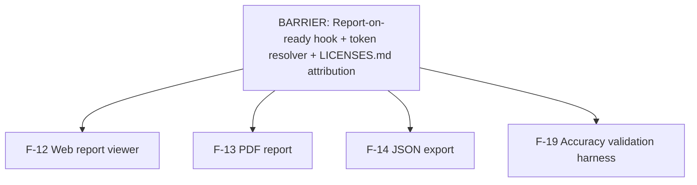

# Build plan — Wave 3 (parallel iteration)

**Status:** APPROVED (Keith, 2026-05-28) · **Iteration slug:** `wave-3-surfaces` · **Planned:** 2026-05-28 · **Source:** [ROADMAP.md](./ROADMAP.md) Wave 3

> Build artifacts are scoped to this slug: branch `build/wave-3-surfaces`,
> worktrees under `.worktrees/wave-3-surfaces/`, report `CONVERGENCE-wave-3-surfaces.md`.

This manifest is the reviewable output of the plan-iteration pass. It
reconciles four independently-drafted feature plans into one frozen set of
shared contracts, a shared barrier, and a build DAG so the features can be
built in parallel without drifting. **No code is written until this is
approved.** Once approved, the build-iteration pass consumes this file plus
the per-spec "Build plan (approved)" sections in `docs/features/`.

## Iteration scope

Four user-facing/validation surfaces that all depend on the now-landed
measurement orchestrator and run in parallel with no interdependencies:

| Feature | Spec | Model tier |
|---|---|---|
| F-12 Web report viewer | [`features/12-web-report-viewer.md`](./features/12-web-report-viewer.md) | `opus` |
| F-13 PDF report | [`features/13-pdf-report-generation.md`](./features/13-pdf-report-generation.md) | `opus` |
| F-14 JSON export | [`features/14-json-export-endpoint.md`](./features/14-json-export-endpoint.md) | `opus` |
| F-19 Accuracy validation harness | [`features/19-accuracy-validation-harness.md`](./features/19-accuracy-validation-harness.md) | `opus` |

## Shared barrier — build & commit FIRST, before any feature fan-out

These land as a single barrier commit. The parallel feature workstreams
start only after this is green.

1. Report-creation-on-ready hook (orchestrator): add idempotent `Report.find_or_create_by!(job: job)` INSIDE the existing MeasurementOrchestrator#persist `job.transaction` block, right after `job.advance_to!(:ready, broadcast: false)`. Land + commit BEFORE fan-out. Update its spec. (Touches the landed F-10 orchestrator — owned by the barrier, not any single Wave-3 feature.) ⚠️ **Build-time caveat (verified against `db/structure.sql:200`):** `index_reports_on_job_id` is currently a **non-unique** btree index, so `find_or_create_by!` is NOT race-safe against a concurrent duplicate. Either make the index unique (`bin/rails generate migration` per convention) and add `validates :job_id, uniqueness: true` to `Report`, or rely on the fact that `persist` runs once per job inside a single transaction and document that assumption. Resolve in the barrier, don't leave it implicit.
2. Freeze + document the token resolver as the canonical path (token -> Report.find_by!(share_token:) -> report.job -> job.latest_measurement; nil job/measurement => not-ready, never 500; bad token => 404). Record in ADR-016 (auth/share-tokens) WITHOUT F-NN references in the committed ADR body. F-12/F-13/F-14 all consume it verbatim.
3. LICENSES.md: lock the canonical attribution text (NAIP, USGS 3DEP, Microsoft Building Footprints, Regrid, Mapbox, Nominatim) as the single source the viewer footer, PDF footer, and JSON provenance all reference (with a static full-list fallback when provenance.attributions is sparse).
4. Confirm/expose orchestrator force-fallback (LIDAR_MISSING) capability for F-19 (env flag or kwarg). If the orchestrator has no way to force the satellite-only path, either add a minimal hook in this barrier or scope F-19's fallback-consistency table as a documented gap. Resolve BEFORE the F-19 runner is built.
5. Confirm the RenderImage*/render-images contract is genuinely usable as-is @ 0.3.0 (verified present) so F-13 starts without a schema change; no barrier code needed beyond this sign-off.

## Frozen shared contracts

Each contract below is **frozen**: build to the exact signature here, not to
prose in a feature spec or ADR where they disagree (the reconciliation
verified each against the real code and ADRs and notes where ADR prose is
superseded).

### Report-creation-on-ready + token resolution (THE shared decision)

- **Produced by:** BARRIER task (orchestrator hook) — landed before fan-out
- **Consumed by:** F-12 (public /r/:token viewer + share link), F-13 (/r/:token.pdf), F-14 (/r/:token.json). NOT F-19.
- **Signature (frozen):**

  ```
  BARRIER (owned by orchestrator): inside MeasurementOrchestrator#persist's existing `job.transaction do ..
  end` block, after `job.advance_to!(:ready, broadcast: false)`, add idempotent `Report.find_or_create_by!(job: job)` (idempotent on index_reports_on_job_id)
  RESOLVER (shared, all surfaces use it verbatim): given a share_token -> `report = Report.find_by!(share_token: params[:token]); job = report.job; measurement = job&.latest_measurement`
  nil job OR nil measurement => render a not-ready state (HTML) / 200-with-null artifacts (JSON), NEVER a 500
  Bad token => 404 (head :not_found), not a redirect
  Contractor path (F-12 viewer at /jobs/:id/report) resolves directly via `@job.latest_measurement` (no Report needed for the gated view; the Report exists for share-link minting)
  Job#latest_measurement is LIVE (newest by generated_at), never a snapshot.
  ```

- **Rationale:** Three surfaces need token->job->latest_measurement and today NO Report is ever created (verified: persist() creates Measurement + advance_to!(:ready) only). Eager find_or_create_by! inside the existing persist transaction is the single cleanest mint point — idempotent, atomic with :ready, and makes every real ready job shareable without a per-surface lazy-create race. F-12's draft proposed lazy find_or_create_by on the contractor page; reconciled to EAGER-in-orchestrator so F-13/F-14 public paths work for jobs whose contractor page was never visited.

### RenderImageRequest / RenderImageResponse (sidecar render-images)

- **Produced by:** F-13 (implements the sidecar endpoint + the Pydantic models already in sidecar/contracts/pipeline.py)
- **Consumed by:** F-13 only (Rails SidecarClient#render_images consumes the response)
- **Signature (frozen):**

  ```
  ALREADY FROZEN @ shared/pipeline_schema.json pipelineSchemaVersion 0.3.0 — NO bump, NO new entity
  RenderImageRequest = {pipelineSchemaVersion:string, job_id:string(uuid), bbox:[min_lon,min_lat,max_lon,max_lat] (4 numbers, WGS84), width_px:integer>=1, height_px:integer>=1}; additionalProperties:false
  RenderImageResponse = {pipelineSchemaVersion:string, job_id:string(uuid), image_ref:string (Spaces artifacts/ key of the rendered PNG)}; additionalProperties:false
  SINGLE image_ref — NOT a {map_image_url,oblique_image_url} pair (ADR-014 prose is SUPERSEDED; oblique/3D deferred).
  ```

- **Rationale:** Verified present in pipeline_schema.json $defs @ 0.3.0. The researcher/contrarian 0.4.0/0.3.1 claims are FALSE. Building to ADR-014's two-URL prose would fail schema validation. Frozen as-is.

### POST /pipeline/render-images (new sidecar endpoint)

- **Produced by:** F-13
- **Consumed by:** F-13 (Rails side via SidecarClient#render_images)
- **Signature (frozen):**

  ```
  New FastAPI APIRouter mounted in sidecar/app/main.py via `app.include_router(render_images_router, dependencies=[Depends(require_bearer)])` (the existing _PIPELINE_DEPS pattern)
  Route: POST /pipeline/render-images; validates RenderImageRequest in, RenderImageResponse out; renders a deterministic top-down map PNG via Playwright (page.set_content, no listening port) against an internal MapLibre viewer page, uploads to Spaces via storage.put_bytes under artifacts/<job_id>/images/map-<hash>.png, returns image_ref
  DISTINCT from the existing POST /pipeline/render-imagery (RenderImagery*) — names are intentionally close; do not conflate.
  ```

- **Rationale:** Verified: main.py mounts per-stage routers with Depends(require_bearer); storage.put_bytes exists. Endpoint is new and F-13-private but frozen so the route string + guard + key layout are unambiguous.

### SidecarClient#render_images (new Rails method)

- **Produced by:** F-13
- **Consumed by:** F-13 (ReportPdf service)
- **Signature (frozen):**

  ```
  def render_images(job_id:, bbox:, width_px:, height_px:, timeout: nil) -> {"image_ref" => String}
  Mirrors the existing per-stage pattern: build payload with PipelineSchema.version, validate_request!("RenderImageRequest", payload), post_json("/pipeline/render-images", payload, timeout:), validate_response!("RenderImageResponse", response), return response
  Add a class-level shortcut self.render_images(...) like the others
  Use a generous timeout (~30s) — Playwright cold start can breach the 5s default.
  ```

- **Rationale:** Verified the SidecarClient per-stage method + validate_request!/validate_response!/post_json transport pattern exists; render_images follows it exactly.

### ArtifactUrlMinter (new, for the artifacts/ prefix)

- **Produced by:** F-13
- **Consumed by:** F-13 (signs the report.pdf + map PNG). F-14 references the resulting URL string only (does not call the minter directly).
- **Signature (frozen):**

  ```
  New service mirroring ImageryUrlMinter but ALLOWED_KEY_PREFIX = "artifacts/"
  def self.call(object_key:, expires_in: <bounded TTL, e.g
  24.hours>) -> signed https GET URL over the Spaces artifacts/ object
  Do NOT reuse ImageryUrlMinter (hard-locked to ALLOWED_KEY_PREFIX="cache/" — it RAISES on artifacts/ keys, verified).
  ```

- **Rationale:** Verified ImageryUrlMinter cannot sign artifacts/ keys. A sibling minter keeps cache/ SSRF guarantees intact (preferred over parameterizing the existing one).

### shared/json_export.schema.json (NEW public contract)

- **Produced by:** F-14
- **Consumed by:** F-14 (JobExportSerializer + JsonExportSchema validator). F-12/F-13 must reuse its field names ([lat,lng] order, area_sq_ft, pitch_ratio rise/12, pitch_degrees, artifacts.pdf_url/share_url) if they surface the same data.
- **Signature (frozen):**

  ```
  New file, JSON Schema draft 2020-12, top-level `schema_version` constant "1.0.0" (INDEPENDENT of pipeline_schema.json's 0.3.0; distinct file, distinct version line)
  Top-level object: {schema_version:"1.0.0", job:{id, address, status}, measurement:{generated_at, source, confidence, total_area_sq_ft, total_perimeter_ft, predominant_pitch_ratio, predominant_pitch_degrees(DERIVED), warnings:[string], facets:[{facet_id, vertices:[[lat,lng]] (FLIPPED from internal [lon,lat]), pitch_ratio, pitch_degrees, area_sq_ft, source, confidence}], features:[{label, bbox_norm:[x0,y0,x1,y1], verified, source, confidence}] (NO position_lat_lng — not derivable from image-space bbox), geocode:{lat,lng,confidence}|null}, provenance:{attributions, retrieved_at, detector, sam2_backend, lidar_work_unit, pipeline_schema_version, generated_at} (all optional/best-effort, best-effort map from orchestrator's NESTED provenance), artifacts:{pdf_url:string|null, share_url:string|null, model_3d_url:null}}
  No collision with pipeline_schema.json (separate file).
  ```

- **Rationale:** Verified the file does NOT exist and provenance is nested (not ADR-015's flat shape); features carry only image-space bbox_norm so position_lat_lng is omitted, not faked. Coordinate FLIP [lon,lat]->[lat,lng] is the public-tool convention and a silent-bug risk — frozen with an explicit serializer test.

### Artifact-URL convention (pdf_url / share_url)

- **Produced by:** F-13 (produces report.pdf + the .pdf routes)
- **Consumed by:** F-12 (footer download buttons), F-14 (artifacts.pdf_url)
- **Signature (frozen):**

  ```
  share_url = the canonical public viewer URL `https://<host>/r/<share_token>` (Rails public_report_url)
  pdf_url = a SIGNED Spaces URL over artifacts/<job_id>/report.pdf minted by ArtifactUrlMinter (bounded TTL ~24h), present only once the PDF has been generated; otherwise null
  F-14 JSON `artifacts.pdf_url` is NULL until a report.pdf exists in Spaces (F-14 does NOT trigger PDF generation; it probes/links)
  F-12 viewer footer download buttons link to /jobs/:id/report.pdf (gated) and /r/:token.pdf (public) — the ROUTES owned by F-13 — and render disabled 'generating…' if the route 404s at build-merge time.
  ```

- **Rationale:** Both F-12 and F-14 reference the PDF URL F-13 produces. Frozen so the three don't invent divergent URL shapes. F-14 ships pdf_url null-now (acceptable) since F-13 is parallel.

### Frozen Facet shape (internal, consumed by all surfaces)

- **Produced by:** F-10 (orchestrator, landed)
- **Consumed by:** F-12 (FacetLayer/serializer), F-13 (PDF facet table), F-14 (export facets, FLIPS vertices to [lat,lng]), F-19 (metrics)
- **Signature (frozen):**

  ```
  pipeline_schema.json $defs/Facet (VERIFIED, additionalProperties:false, all required): {facet_id:string, vertices:[[lon,lat] WGS84, >=3 pts, each 2-3 numbers], pitch_ratio:number>=0 (rise per 12), pitch_degrees:number 0..90, area_sq_ft:number>=0, source:GeometrySource enum(lidar|imagery|fusion|capture|manual), confidence:number 0..1}
  There is NO `id` and NO `vertices_wgs84`
  pitch_degrees IS stored per-facet (no conversion needed).
  ```

- **Rationale:** All three input drafts invented vertices_wgs84/facet.id. Frozen against the verified $def so no builder ships a broken serializer.

### Frozen Feature shape (internal, consumed by all surfaces)

- **Produced by:** F-10 (orchestrator, landed)
- **Consumed by:** F-12 (side-panel features table; pins anchored near roof centroid), F-13 (PDF feature list), F-14 (export features, OMITS position_lat_lng)
- **Signature (frozen):**

  ```
  pipeline_schema.json $defs/Feature (VERIFIED, additionalProperties:false, all required): {label: enum(vent|chimney|dormer|skylight|satellite_dish|other), bbox_norm:[x0,y0,x1,y1] each in [0,1] IMAGE-space against the satellite tile, verified:boolean, source:GeometrySource, confidence:number 0..1}
  NO geographic center is emitted — feature pins cannot be precisely geolocated without an orchestrator change (documented v1 limitation).
  ```

- **Rationale:** NOTE: FeatureDetector::KNOWN_LABELS used by F-19 is {chimney,vent,skylight,dormer,satellite_dish} (5, no 'other'); the SCHEMA enum adds 'other'. F-19 mirrors the Ruby constant for eval; surfaces accept the full enum incl. 'other'.

### Measurement row roll-ups + nested provenance (serializer source-of-truth)

- **Produced by:** F-10 (orchestrator, landed)
- **Consumed by:** F-12 (footer attributions from provenance.attributions), F-13 (PDF attribution footer), F-14 (JSON provenance best-effort map)
- **Signature (frozen):**

  ```
  Measurement columns (VERIFIED db + orchestrator#persist): total_area_sq_ft, predominant_pitch_ratio (ONLY the ratio is stored — predominant pitch_degrees must be DERIVED), total_perimeter_ft, geocode (Address {raw,normalized,lon,lat,source,confidence}), source, confidence, warnings(jsonb array), facets(jsonb), features(jsonb), provenance(jsonb NESTED)
  provenance shape (VERIFIED build_provenance): {pipeline_schema_version, detector(=FeatureDetector::DETECTOR_NAME), sam2_backend, geometry_source, lidar_work_unit:{name,year,quality_level}|absent, attributions:{resolve_address,imagery,lidar} (each a SourceAttribution, .compact so absent stages omitted), retrieved_at:{...}, generated_at}
  There is NO flat imagery_source/sam2_version/vlm_model.
  ```

- **Rationale:** F-14's draft correctly caught the flat-vs-nested mismatch; verified nested. Attribution surfaces (NAIP, USGS 3DEP, MS Footprints, Regrid, Mapbox, Nominatim) must read from provenance.attributions with a static full-list fallback; canonical wording locked in LICENSES.md, shared by all three surfaces.

### api/v1 JSON 401 + /r/:token.json CORS contract

- **Produced by:** F-14
- **Consumed by:** F-14 (F-12 must NOT create these routes — it bakes the payload into an HTML data attribute instead)
- **Signature (frozen):**

  ```
  GET /api/v1/jobs/:id.json (new, F-14): skip_before_action :require_demo_login + a JSON before_action that returns 401 (head/render :unauthorized, NO Location header) when !logged_in? — mirrors Api::V1::CaptureSessionsController (VERIFIED pattern)
  GET /r/:token.json (new, F-14): public, token-gated (404 on bad token, no redirect), sets `Access-Control-Allow-Origin: *` via a controller response header (NO rack-cors gem — VERIFIED absent)
  Both routes return IDENTICAL JobExportSerializer output (no redaction, no route-conditional branches)
  /api/v1 sets NO CORS header.
  ```

- **Rationale:** Verified inherited require_demo_login 302-redirects; tools need 401. Verified no rack-cors. Frozen so F-12 does not build a competing measurement-JSON endpoint (collision risk).

## Build DAG

After the shared barrier lands, all four features are mutually independent
(near-disjoint file sets). Cross-feature references are link-only with
null/disabled fallbacks, so none blocks another at build time.



| Feature | Depends on (within iteration) | Unblocks | Parallel with |
|---|---|---|---|
| F-12 Web report viewer | BARRIER: Report-creation-on-ready hook + token resolver; BARRIER: LICENSES.md canonical attribution text | F-13 footer download buttons (links to F-13 routes), but no code dependency | F-13, F-14, F-19 |
| F-13 PDF report | BARRIER: Report-creation-on-ready hook + token resolver; BARRIER: LICENSES.md canonical attribution text | F-12 footer pdf download (route target); F-14 artifacts.pdf_url (URL target only, null-now) | F-12, F-14, F-19 |
| F-14 JSON export | BARRIER: Report-creation-on-ready hook + token resolver; BARRIER: LICENSES.md canonical attribution text | consumers of the public versioned JSON contract (external) | F-12, F-13, F-19 |
| F-19 Accuracy validation harness | BARRIER: orchestrator force-fallback (LIDAR_MISSING) capability — MUST be confirmed/exposed before the runner is built; HUMAN pre-build: 15 stratified addresses, EagleView purchase, tape-measure, NAIP tile hand-labeling | — | F-12, F-13, F-14 |

**Convergence/rework outlook:** Convergence risk is LOW once the barrier lands, because the four features touch almost-disjoint file sets and the only shared mutations are pre-frozen. The single highest-risk item — Report creation + token resolution, needed by THREE surfaces — is removed from the parallel phase entirely by landing it as barrier step 1+2 (one orchestrator edit + one ADR/resolver freeze) before fan-out; all three surfaces then consume an identical, already-tested resolver, so they cannot diverge. The render-images schema is already frozen @ 0.3.0 (verified, no bump), so F-13's sidecar work needs no coordination with the others. F-14's json_export.schema.json is a NEW separate file (no collision with pipeline_schema.json). The two genuine file-overlap points are config/routes.rb (F-13 adds .pdf formats, F-14 adds .json routes — additive, different lines, trivial 3-way merge) and reports_controller.rb / jobs_controller.rb (F-12 replaces the show_public/report stubs with the real viewer; F-13 adds .pdf respond_to; F-14 adds .json respond_to — assign F-12 as the controller-shape owner so F-13/F-14 add format branches rather than rewriting, keeping the merge a small format-block append). The cross-feature URL references (F-12 footer -> F-13 .pdf routes; F-14 artifacts.pdf_url -> F-13 PDF) are link-only with null/disabled fallbacks, so neither blocks the other at build time. F-19 is fully isolated (sidecar/validation/ + lib/tasks/validation.rake, reads Measurement directly, needs NO Report) and its only dependency (force-fallback) is resolved in the barrier or scoped as a gap. Expect near-zero rework beyond the additive routes/controller merges; the main wall-clock risk is F-19's human data-collection and F-12's JS-toolchain bootstrap, both of which start independently of the others.

## Model-tier rationale

- **F-12 Web report viewer → `opus`:** JS toolchain bootstrap from zero (esbuild+React+MapLibre+deck.gl+TS alongside importmap), WebGL/Turbo lifecycle, the shared Report/token contract, and a serializer that must not invent fields — high coordination + correction load.
- **F-13 PDF report → `opus`:** Two-service Playwright+Grover orchestration, a new sidecar endpoint + SidecarClient method + ArtifactUrlMinter, the ADR-014 supersession, and the shared artifact-URL convention — cross-language contract work.
- **F-14 JSON export → `opus`:** Designs a NEW versioned public contract against real (not ADR-idealized) data, the nested->flat provenance map, the [lon,lat]->[lat,lng] flip (silent-bug risk), and the 401/CORS semantics — contract-defining, error-prone if rushed.
- **F-19 Accuracy validation harness → `opus`:** The decisive language-boundary correction (runner is a Rails rake task, not Python-calls-sidecar), force-fallback dependency, allowlisted-tile-URL feeding detect(), and honest statistical framing — architecture judgment, not mechanical.

## Cross-cutting checklist (every feature honors these)

- [ ] Honest-uncertainty UX: every surface renders measurement+facet source AND confidence; low-confidence is MARKED (muted gray), never hidden; the method (lidar/imagery/fusion) is named. (F-12 side panel, F-13 PDF table, F-14 JSON fields.)
- [ ] Confidence-aware artifact propagation: source+confidence flow sidecar->Rails(Measurement)->JSON->PDF->viewer with NO surface dropping them. predominant_pitch_degrees and per-facet pitch_degrees must be present (degrees DERIVED for the predominant; per-facet already stored).
- [ ] CompanyCam brand voice: orange ONLY on the primary CTA and the PDF header bar; charcoal text; muted grays for confidence; measurement-instrument aesthetic (not Google-Earth). All surfaces consume the existing F-04 brand tokens from app/assets/tailwind/brand.css — no new tokens, no SCSS, no redefinition.
- [ ] Auth boundary: contractor surfaces (/jobs/:id/report, /jobs/:id/report.pdf, /api/v1/jobs/:id.json) require_demo_login (api/v1 returns 401 not 302); public surfaces (/r/:token, /r/:token.pdf, /r/:token.json) are public read-only, 404 (not redirect) on bad token, X-Robots-Tag: noindex on the HTML viewer + PDF share.
- [ ] Attribution surfaces: NAIP, USGS 3DEP, Microsoft Building Footprints, Regrid, Mapbox, Nominatim appear in viewer footer + PDF footer + JSON provenance, sourced from provenance.attributions with the LICENSES.md static fallback.
- [ ] Outbound-URL SSRF allowlist: any URL handed to an external fetcher stays on the allowlisted Spaces host via a signed minter (ImageryUrlMinter for cache/, new ArtifactUrlMinter for artifacts/). F-13's Mapbox Static fallback validates a WGS84-sane bbox before constructing the URL; no unvalidated interpolation. F-12 bakes the payload into HTML (no public data endpoint) to avoid opening a CORS/SSRF surface.
- [ ] No F-NN references in any permanent artifact (code/config/committed ADRs/LICENSES.md/schemas) — only in feature files, commits, and PR bodies.
- [ ] Migrations ONLY via `bin/rails generate migration`; schema is structure.sql (PostGIS), not schema.rb; UUID PKs. (Wave 3 needs NO migrations — Report row already exists; no cached_pdf_url column.)
- [ ] Tests run bare against PostGIS on localhost:5433 with no DATABASE_* env vars; skeleton/pipeline specs boot a real sidecar subprocess (uv required). F-19's runner must not leave committed Job/Measurement rows in the dev/test DB.
- [ ] Fail-fast-at-boot: MAPBOX_PUBLIC_TOKEN initializer raises in prod / warns in dev-test when the dependent feature is enabled; documented in ops/.env.example.

## Human decisions required before approval

Resolve these before approving the plan and launching the build.

> **Resolutions (Keith, 2026-05-28):**
> 1. **APPROVED** — eager `Report.find_or_create_by!(job:)` in the orchestrator barrier.
> 2. **DONE** — `MAPBOX_PUBLIC_TOKEN` provisioned.
> 3. **Delegated to the build** — see the build-owned infra note below; not a blocking human decision. (One human check remains: `ssh gauntlet "df -h /"` for ~500 MB headroom before first deploy.)
> 4. **Delegated to the build** — see the build-owned infra note below; not a blocking human decision.
> 5. **DOCUMENT AS A GAP** — F-19 ships without the fallback-consistency table; note the deferral in ADR-017. Orchestrator stays untouched.
> 6. **ACCEPT ALL THREE deviations** — omit feature `position_lat_lng`, best-effort/optional provenance, lock ADR-015's field names now. **Framing (Keith):** the JSON schema is a *prototype* — getting v1.0.0 perfect doesn't matter, no external consumer is locked in yet, so it can change freely. The breaking-change CI guard is a drift-catcher, NOT a hard external contract; `schema_version` bumps are cheap.
> 9. **Second model = `qwen/qwen2.5-vl-72b-instruct`** (cross-architecture vs the `google/gemini-2.5-flash` default). Eval tiles served via **signed Spaces URLs** (reuse the `ImageryUrlMinter` pattern) — keep the SSRF host allowlist tight; do NOT widen it.
> 10. **ACCEPT all five cuts** — flat facets, centroid-anchored pins, disabled LiDAR toggle, static-ERB side panel, manual visual-regression. The LiDAR point-cloud toggle ships **disabled with a "point overlay coming soon" tooltip** (not a bare dead control).
>
> Still open (not gating fan-out): **7** (LICENSES.md attribution wording — barrier step 3) and **8** (F-19 human data collection — start in parallel now; gates only the final report).

### Build-owned infra prep (resolves decisions 3 & 4) — verified against the repo

Neither of these exists today; the F-12 / F-13 builders own them as explicit tasks
(the planning session confirmed the current state, it does not pre-build them):

- **Node + JS build in the Rails image (F-12, decision 4).** The Rails `Dockerfile`
  is Ruby-only — the app ships `importmap-rails` + `propshaft` + `tailwindcss-rails`,
  so `bin/rails assets:precompile` has no JS build step. Introducing `jsbundling-rails`
  + esbuild means the **build stage must install Node + run `yarn install && yarn build`
  before `assets:precompile`**, or the viewer bundle silently ships empty. The CI
  `rails_test` job runs in `ruby:4.0.1-slim` via `docker run` — it must also `apt-get
  install` Node (or the build step is added to the image the job uses) so the bundle
  exists for `:js` specs.
- **Chromium in CI + both images (F-12 & F-13, decision 3).** No browser exists
  anywhere today. The GitLab runner is a **shell executor** running tests inside
  `docker run` with `ruby:4.0.1-slim` (Rails) and `python:3.12-slim` (sidecar) — neither
  has Chromium. F-12's `:js` system specs need headless Chrome + a webdriver in the
  Rails CI container; F-13 needs Chromium in the **Rails image** (Grover/Puppeteer)
  **and** the **sidecar image** (Playwright). Each builder adds the install to the
  relevant `docker run` invocation in `.gitlab-ci.yml` and to its production
  Dockerfile, with `--no-sandbox` launch flags for the containerized runtime. Confirm
  ~500 MB droplet disk headroom before the first deploy (the one genuinely human check
  here — `ssh gauntlet "df -h /"`).

### Original decision list

1. APPROVE the barrier decision: eager Report.find_or_create_by!(job:) inside the orchestrator persist transaction (reconciled from F-12's 'lazy on contractor page' to eager-in-orchestrator so F-13/F-14 public paths work for never-visited jobs). All three surface owners must accept this before fan-out. — **APPROVED.**
2. Provision MAPBOX_PUBLIC_TOKEN (public-scope: Satellite raster tiles + Static Images API) for dev/test/CI/prod; add to ops/.env.example and /etc/rooftrace/.env on the droplet. Shared by F-12 (basemap) and F-13 (sidecar headless tiles + Mapbox Static fallback). — **DONE.**
3. Confirm headless Chrome + selenium-webdriver in CI (F-12 :js system specs) AND chromium present in both the Rails image (Grover/Puppeteer) and sidecar image (Playwright) for F-13 — and that the shared gauntlet droplet has ~500MB disk headroom for the two Chromium installs.
4. Confirm Node/yarn in the build + CI image and that the deploy build step (Dockerfile/deploy.sh) runs the esbuild JS build so the viewer bundle ships in the release.
5. Decide whether to expose orchestrator force-fallback (LIDAR_MISSING) for F-19's fallback-consistency metric, or accept it as a documented gap (ADR-017). — **RESOLVED: document as a gap.** F-19 ships without the fallback-consistency table; ADR-017 records the deferral. Orchestrator unchanged.
6. Sign off on F-14's deviations from ADR-015's example. — **RESOLVED: accept all three** (omit `position_lat_lng`, best-effort/optional provenance, lock the field names now). **The schema is a prototype** — no external consumer is locked in, so v1.0.0 need not be perfect and can change freely; the breaking-change CI guard is a drift-catcher, not a hard contract.
7. Product/legal sign-off on the exact LICENSES.md attribution wording (the 6 sources) so viewer/PDF/JSON share one final string. — **OPEN** (barrier step 3; not gating fan-out — the static fallback text can be finalized during the barrier).
8. Human pre-build phase for F-19 (start in parallel, gates the report): pick 15 stratified addresses with 3DEP coverage, purchase 1 EagleView (~$80, 1-2 days), tape-measure 1 roof, pull 1 assessor record, hand-label NAIP tiles (~4-6h), provision a dedicated harness Postgres DB, then one full live run (~$5 Modal+OpenRouter) to populate docs/VALIDATION_REPORT.md. — **OPEN** (start now; gates only F-19's final report, not the code).
9. F-19 >=2-model sweep. — **RESOLVED: `google/gemini-2.5-flash` (default) + `qwen/qwen2.5-vl-72b-instruct`** (cross-architecture comparison). Eval tiles served via **signed Spaces URLs** (`ImageryUrlMinter` pattern); SSRF allowlist stays tight.
10. Accept F-12 v1 scope cuts. — **RESOLVED: accept all five** (flat facets, centroid-anchored pins, disabled LiDAR toggle, static-ERB side panel, manual visual-regression). The disabled LiDAR point-cloud toggle ships **with a "point overlay coming soon" tooltip**, not as a bare dead control.

## After approval

1. Land the **shared barrier** as one commit (orchestrator Report hook +
   ADR-016 resolver amendment + LICENSES.md attribution text), with its spec.
2. Fan out one worktree-isolated workstream per feature, each building
   test-first to its per-spec "Build plan (approved)" checklist and the
   frozen contracts above.
3. Each feature runs the adversarial review panel to clean, gated on
   spec + security findings.
4. Converge the per-feature branches into one linear MR for human landing.
