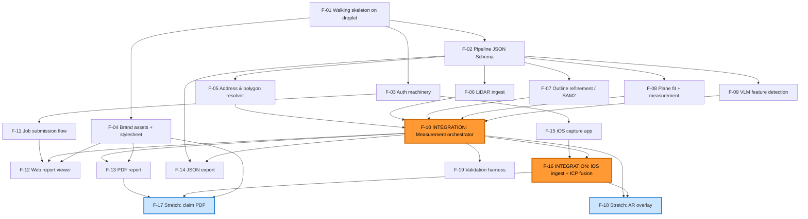

# Roadmap — RoofTrace

**Status:** agreed (v1) · **Date:** 2026-05-27 · **Source:** [ARCHITECTURE.md](./ARCHITECTURE.md), [COMPANY.md](./COMPANY.md), [ADRs](./adrs/)

## Overview

RoofTrace is a roof-measurement system for CompanyCam contractors,
sliced into **19 features across six tracks**: a Walking-Skeleton-first
foundation, three foundational contracts (pipeline schema, auth, brand
assets), four parallel geospatial-pipeline features that converge on a
**measurement-orchestrator integration feature**, three parallel app-layer
features (submit, web viewer, PDF, JSON export), a two-feature iOS track
whose backend half is a second **fusion integration feature**, two stretch
features depending on the integrations, and a standalone validation
harness. **Delivery strategy:** deploy the empty stack to the droplet on
Day 1; build the pipeline + app tracks in parallel after contracts land;
two explicit integration features (F-10 and F-16) are where parallelism
re-synchronizes.

## Project Pieces

| ID | Piece | Purpose | Depends on | Unblocks | Parallel with |
|----|-------|---------|-----------|----------|---------------|
| F-01 | Walking skeleton on the droplet | Rails + sidecar + Postgres deployed via Kamal to `rooftrace.biograph.dev`; one endpoint round-trips Rails → sidecar → Rails returning a hardcoded measurement | — | F-02, F-03, F-04, all others transitively | — |
| F-02 | Pipeline JSON Schema contract | `shared/pipeline_schema.json` defines the Rails↔sidecar request/response shape; types for both languages | F-01 | F-05, F-06, F-07, F-08, F-09, F-10, F-14 | F-03, F-04 |
| F-03 | Auth machinery | Dev login + share-token + iOS capture-token; sessions, controllers, model columns | F-01 | F-11, F-12, F-15, F-16 | F-02, F-04 |
| F-04 | Brand assets + shared report stylesheet | RoofTrace wordmark, palette, print + screen CSS in `app/assets/` consumed by viewer and PDF | F-01 | F-12, F-13, F-17 | F-02, F-03 |
| F-05 | Address & polygon resolver | Geocode (Nominatim) + MS Building Footprints + Regrid parcel, cached via Rails into PostGIS | F-01, F-02 | F-10 | F-06, F-07, F-08, F-09 |
| F-06 | LiDAR ingest | WESM coverage check + COPC streaming + PDAL crop to building points; emits NumPy point array in local UTM | F-01, F-02 | F-10 | F-05, F-07, F-08, F-09 |
| F-07 | Outline refinement | SAM2 zero-shot with footprint prior, Modal serverless + local-CPU fallback, Douglas–Peucker simplification | F-01, F-02 | F-10 | F-05, F-06, F-08, F-09 |
| F-08 | Plane fit + measurement | RANSAC multi-plane fit on cropped LiDAR points; pitch from normals, area from projected extent; emits facet list | F-01, F-02 | F-10 | F-05, F-06, F-07, F-09 |
| F-09 | VLM feature detection (Rails) | RubyLLM → Gemini Flash with verification pass; emits structured detections | F-01, F-02 | F-10 | F-05, F-06, F-07, F-08 |
| **F-10** | **Integration: measurement orchestrator** | GeometryJob in Solid Queue chains F-05 → F-06 → F-07 → F-08 + parallel F-09; assembles unified measurement; handles LiDAR-missing fallback | F-05, F-06, F-07, F-08, F-09 | F-12, F-13, F-14, F-16, F-18, F-19 | F-11 |
| F-11 | Job submission flow | Address-entry form, Solid Queue enqueue, ActionCable status Turbo Streams | F-01, F-03 | F-12 | F-05–F-10 |
| F-12 | Web report viewer | Hotwire page + React island, MapLibre basemap, deck.gl facet extrusion, feature pins | F-01, F-03, F-04, F-10, F-11 | — | F-13, F-14 |
| F-13 | PDF report | Grover + Rails template + sidecar map-image render; baseline measurement PDF | F-01, F-04, F-10 | F-17 | F-12, F-14 |
| F-14 | JSON export | `/api/v1/jobs/:id.json` endpoint, schema-validated against `shared/json_export.schema.json` | F-01, F-02, F-10 | — | F-12, F-13 |
| F-15 | iOS capture app | Swift Xcode project; guided walk-around UX; ARKit world-mesh + depth + photos + GPS+IMU; multipart upload | F-01, F-03 | F-16 | F-05–F-10 |
| **F-16** | **Integration: iOS capture ingest + ICP fusion** | Rails ActiveStorage ingest + FusionJob in sidecar that ICP-aligns ARKit mesh to public-LiDAR points and re-runs plane fit | F-10, F-15 | F-17, F-18 | — |
| F-17 | Stretch: claim-defensibility PDF | Methodology footnote, visit-verified block, evidence photos, signature line, construction-doc chrome | F-13, F-16 | — | F-18 |
| F-18 | Stretch: server-side AR overlay | Pinhole projection of facets onto captured photos with z-buffer occlusion; surfaces in viewer + PDF | F-10, F-16 | — | F-17 |
| F-19 | Accuracy validation harness | 15 LiDAR-covered + 3 ground-truth addresses; MAPE + P90 + structural validity; generates `docs/VALIDATION_REPORT.md` | F-10 | — | (anytime after F-10) |

## Dependency Graph

The two **orange integration nodes (F-10 and F-16)** are where parallel
tracks re-synchronize. Both have acceptance criteria written against
the *combined* behavior of their inputs, not the individual pieces.

## Critical Path

**F-01 → F-02 → F-06 (LiDAR ingest) → F-10 → F-16 → F-18.**

This is the longest dependency chain in the graph — it determines the
minimum schedule, end-to-end.

- **F-01** must land first (everything else needs the deployed stack).
- **F-02** is the contract every pipeline feature reads; lock it before
  the pipeline track diverges so 4 agents don't write 4 incompatible
  schemas.
- **F-06 (LiDAR)** is the longest of the four pipeline features
  (geocode/polygons F-05 is faster; SAM2 F-07 is bounded by Modal
  setup; plane-fit F-08 is bounded by RANSAC tuning; VLM F-09 is a
  RubyLLM call). LiDAR includes the WESM coverage check, COPC streaming,
  CRS reprojection, and PDAL pipeline composition — historically eats
  ~1 day even for a skilled geospatial dev. **This is the
  schedule-determining feature in the pipeline track.**
- **F-10 (orchestrator integration)** can only start once all five
  pipeline features have a working contract; it has the highest
  *coordination* risk because contract drift across the four
  parallel pipeline features lands here.
- **F-16 (iOS fusion integration)** requires both the iOS app
  (F-15) and the orchestrator (F-10). The orchestrator is usually
  ready first since the iOS track tends to take longer.
- **F-18 (AR overlay stretch)** depends on F-16; it is the final
  feature on the critical path and the most-visible demo moment.
  Easy to defer if behind schedule.

**Convergence points to watch:**

1. **F-10 (measurement orchestrator).** Five inputs (F-05–F-09)
   produce a unified measurement. Risk: contract drift across
   parallel pipeline features. Mitigation: F-02 (the JSON Schema)
   is the single source of truth; every pipeline feature validates
   its output against the schema as part of its acceptance.
2. **F-16 (iOS fusion integration).** Two inputs (F-10 + F-15)
   in different languages and stacks. Risk: ARKit mesh coordinate-
   frame disagreement with the public-LiDAR cloud (the whole point
   of ICP). Mitigation: F-16's acceptance demands a numerical
   alignment-error metric below threshold on a fixture session.

## Parallelization Plan

### Wave 0 — Bootstrap (1 agent, blocks everything)

- **F-01** Walking skeleton.

### Wave 1 — Contracts & foundation (3 agents in parallel)

After F-01 lands, three independent agents can start:
- **F-02** Pipeline schema (will unblock the geospatial pipeline track).
- **F-03** Auth machinery (will unblock the app + iOS tracks).
- **F-04** Brand assets + report stylesheet (will unblock viewer + PDF).

### Wave 2 — Parallel construction (up to 7 agents in parallel)

Once Wave 1's contracts are in place:

**Geospatial pipeline track (5 agents possible, all parallel):**
- F-05 Address & polygon resolver
- F-06 LiDAR ingest **← critical path**
- F-07 Outline refinement (SAM2)
- F-08 Plane fit + measurement
- F-09 VLM feature detection (Rails)

Each consumes the F-02 schema; each is self-contained behind its
contract. The Python sidecar tracks (F-05, F-06, F-07, F-08) all
share `sidecar/`; minor coordination on common deps but no overlap on
business logic. F-09 lives in Rails (RubyLLM per ADR-006).

**App-layer track (2 agents possible, parallel with the pipeline):**
- F-11 Job submission flow (form + Solid Queue + ActionCable)
- F-15 iOS capture app (Swift) — parallel with everything else;
  longest single-agent feature.

### Wave 3 — Integration & user surfaces (after F-10 lands)

The orchestrator (**F-10**) is the first integration. Once green:
- **F-12** Web report viewer (consumes F-10 output)
- **F-13** PDF report (consumes F-10 output)
- **F-14** JSON export (consumes F-10 output)
- **F-19** Validation harness (consumes F-10; can run in parallel
  with the surfaces)

These four can run in parallel.

### Wave 4 — iOS integration (after F-10 + F-15)

- **F-16** iOS capture ingest + ICP fusion. Unblocks both stretches.

### Wave 5 — Stretches (after F-16, parallel)

- **F-17** Claim-defensibility PDF (consumes F-13, F-16)
- **F-18** Server-side AR overlay (consumes F-10, F-16)

### What a fresh agent needs before starting

- For any pipeline feature (F-05–F-09): read
  `ARCHITECTURE.md`, the relevant ADRs, the pipeline schema
  `shared/pipeline_schema.json`, and run the F-01 walking skeleton
  locally to confirm the IPC boundary works.
- For app-layer features (F-11–F-14): read ARCHITECTURE.md, F-03's
  auth surface, F-04's brand contract, and F-10's output shape.
- For iOS work (F-15): read [ADR-007](./adrs/ADR-007-mobile-capture-thin-ios-app.md)
  in full; confirm Pro iPhone hardware availability or commit to
  fixture-driven dev.
- For stretches (F-17, F-18): the relevant integration feature
  (F-16) must be merged and a fixture iOS session must exist in
  `spec/fixtures/`.

## Cross-Cutting Concerns

| Concern | Source of truth | Rule features must follow |
|---|---|---|
| **CompanyCam brand & voice** | [COMPANY.md §Brand & voice](./COMPANY.md) | All user-facing copy and UI must match the contractor-respectful, plainspoken trade-magazine register. Color use: orange as primary CTA only; charcoal text on white; muted grays for confidence/secondary. |
| **Pipeline contract** | `shared/pipeline_schema.json` (delivered by F-02; per-stage envelopes added in F-05–F-09 @ 0.2.0) | Every Rails↔sidecar call validates request and response against this schema. Schema changes are PRs that bump the contract version and update both clients. Per-stage shapes (`ResolveAddress*`, `IngestLidar*`, `RefineOutline*`, `FitPlanes*`/`MeasurementGeometry`, `DetectFeatures*`) live here, not as ad-hoc per-feature shapes. |
| **Blob-reference convention** *(F-06/F-07/F-08/F-09)* | `shared/pipeline_schema.json` + [ADR-010](./adrs/ADR-010-blob-storage-do-spaces.md) | Point clouds and image tiles **never cross the contract inline** — they cross as a **Spaces object key** (`point_array_ref`, `image_tile_ref`) in the one prefixed bucket. The orchestrator (F-10) mints a short-lived signed URL when a stage must fetch one. A stage that needs bytes uses `sidecar/app/storage.py` (`get_bytes`/`put_bytes`), which refuses keys escaping the local root. |
| **Cropped point-array layout** *(F-06 → F-08, learned at convergence)* | F-06 `ingest.py` (producer) | The `.npy` referenced by `point_array_ref` is **`(N, 4)` `[x, y, z, classification]`** in the local UTM zone, class pre-filtered to ASPRS-6. Consumers (F-08, F-16) must take `[:, :3]` for geometry. The contract carries only the opaque ref, so this layout is the convention every consumer follows. *(A 3-vs-4-column mismatch broke F-08 at integration; this row exists so the next consumer doesn't repeat it.)* |
| **`utm_zone` is a full EPSG code** *(F-06 → F-08, learned at convergence)* | `shared/pipeline_schema.json` (`IngestLidarResponse.utm_zone`, `FitPlanesRequest.utm_zone`) | The `utm_zone` field is the **full WGS84/UTM EPSG code** (e.g. `32614`), NOT a 1–60 zone number. Consumers transform vertices back to WGS84 with it directly. *(F-08 initially did `32600 + utm_zone` → `EPSG:65214`; caught at integration.)* |
| **JSON export contract** | `shared/json_export.schema.json` (delivered by F-14) + [ADR-015](./adrs/ADR-015-json-export-schema-versioned.md) | Versioned semver; v1.x additive only; v2.x reserved for breaking changes; one fixture validates in CI. |
| **CRS discipline** | [ADR-003](./adrs/ADR-003-lidar-source-usgs-3dep-copc.md), [ADR-004](./adrs/ADR-004-footprint-source-ms-building-footprints-regrid.md) | All polygons stored as WGS84 (SRID 4326); reprojected to local UTM for area math. PostGIS `geography` type for spherical sanity. Areas in m² (converted to sq ft only at the presentation boundary). |
| **Honest uncertainty UX** | [COMPANY.md §Concrete design guidance](./COMPANY.md), [ADR-001](./adrs/ADR-001-geometry-architecture-sat-lidar-fusion.md), [ADR-006](./adrs/ADR-006-feature-detection-vlm-primary.md) | Every measurement carries `source` + `confidence`; UI surfaces method ("from LiDAR" / "from imagery" / "from your photo capture"); never hide low-confidence results, mark them. |
| **Confidence-aware artifact propagation** | [ADR-015](./adrs/ADR-015-json-export-schema-versioned.md) | `source` and `confidence` propagate from sidecar → Rails → JSON export → PDF report. No surface drops them. |
| **Auth boundary** | [ADR-016](./adrs/ADR-016-auth-dev-login-plus-share-tokens.md) (delivered by F-03) | All submit routes gated by `require_demo_login`; share routes (`/r/:token`) public, read-only, `noindex`; iOS routes gated by short-lived bearer token scoped to one job. |
| **Outbound-URL SSRF** *(F-09 review; applies to any stage that hands a URL to an external fetcher)* | This row | Any URL we pass to a third party that fetches it server-side (Gemini image fetch today; any future VLM/tile fetcher) MUST be host-allowlisted — scheme `https` + an allowlisted host suffix (the Spaces CDN; env-overridable) — *before* it's sent. Reject loopback / link-local (169.254.x metadata) / `file:`. A storage `*_ref` + an internally-minted signed URL is preferred over accepting a caller URL. Brief the security review with this lens. |
| **External-secret transport** *(F-09/F-05 review)* | This row | Provider API keys go in **headers**, never the URL query string (Gemini → `x-goog-api-key`). Where a provider mandates a query-param token (Regrid free tier), keep it out of exception messages/logs — report the error class, not the URL. |
| **Pipeline-stage env config fail-fast** *(F-06 review; owned by F-10 + deploy)* | [ADR-011](./adrs/ADR-011-deploy-kamal-do-droplet.md) consequences | A stage whose live path needs env config (F-06: `LIDAR_LIVE` + `WESM_GPKG_PATH`; storage: `STORAGE_*`) currently resolves it lazily per-request, so a misconfigured deploy boots green then 502s every call. F-10/deploy must wire these in `ops/compose.prod.yaml` + `ops/.env.example` and **fail fast at sidecar boot** when a pipeline stage is enabled but its config is missing — matching the Rails `after_initialize` raise-in-prod pattern. |
| **Storage organization** | [ADR-010](./adrs/ADR-010-blob-storage-do-spaces.md) | Four buckets with distinct retention/visibility: `uploads/` private + signed, `cache/` 30-day TTL, `artifacts/public/<token>/...` public-read, `backups/` lifecycle-retained. |
| **License & attribution** | `LICENSES.md` (created by F-01 / F-02 + maintained as new sources added) | NAIP, MS Footprints, Mapbox, Nominatim, Regrid all require attribution surfaces in viewer + PDF. |
| **Testing — visible-in-CI gate** | This roadmap (cross-cutting), each feature spec | Each feature ships with the tests named in its "Testing requirements" section. PRs must show green CI before merge. |
| **Demo set discipline** | [ADR-017](./adrs/ADR-017-accuracy-validation-harness.md) (delivered in F-19) | `sidecar/validation/test_addresses.yaml` is the single source of demo addresses; demo scripts pull from it. No ad-hoc addresses in the live demo. |
| **Deploy story** *(amended F-01)* | [ADR-011](./adrs/ADR-011-deploy-kamal-do-droplet.md) (delivered by F-01) | All services run as containers. **v1 deploy tool is docker-compose, NOT Kamal** (`ops/compose.prod.yaml` is the production source of truth). Deployed containers join the droplet's shared **`openemr_default`** network; the host's **containerized Caddy** (`openemr-caddy-1`) reverse-proxies to the web container **by name** (`rooftrace-web`) via a `*.caddyfile` drop-in in `/etc/caddy/conf.d/`. Postgres + sidecar stay on a private `internal` network. Any feature exposing HTTP follows this pattern (see `ops/README.md`). Kamal (`ops/deploy.yml`) is the documented future multi-host path. |
| **Documentation hygiene** | This file + per-ADR consequences sections | Architectural decisions land as ADRs (no in-feature ADRing); load-bearing implementation notes from a feature that affect *other* features must propagate to ARCHITECTURE.md or ROADMAP.md, not just sit in the feature file. |

## High-Level Acceptance Criteria

| ID | Done when … |
|----|---|
| F-01 | `kamal deploy` succeeds; `https://rooftrace.biograph.dev/health` returns 200; one demo endpoint round-trips Rails → sidecar → Rails and persists/reads one row in Postgres. |
| F-02 | `shared/pipeline_schema.json` exists; Rails-side serializer + Python-side Pydantic model both validate against it; CI runs the validation. |
| F-03 | Submit pages 302-redirect to `/login` when unauthenticated; `/r/:token` serves a public read-only stub; iOS capture endpoint rejects requests missing/expired bearer tokens. |
| F-04 | Wordmark + palette tokens in `app/assets/`; shared `report.scss` consumed by a stub viewer page and a stub PDF page; print-only sections gated by `@media print`. |
| F-05 | Given an address, returns geocoded lat/lng + parcel polygon + building polygons (intersected with parcel) in WGS84; caches Nominatim/Regrid/MS responses. |
| F-06 | Given a building polygon, returns either `(point_array_utm, work_unit_metadata)` or a `LIDAR_MISSING` signal with reason; works on 3 LiDAR-covered demo addresses and 1 known-gap address. |
| F-07 | Given an image tile + a prior polygon, returns a refined polygon (and an IoU vs. prior for sanity). Modal path and local-CPU path both pass the same test. |
| F-08 | Given a point cloud, returns a facet list with vertices (UTM), pitch (degrees + ratio), area (m²), and confidence; total area within ±3% of a fixture LiDAR-only ground-truth. |
| F-09 | Given a tile + a roof polygon, returns a structured detection list (label, bbox_norm, confidence, source) matching the JSON Schema; verification pass downgrades low-confidence detections. |
| F-10 | Submitting an address via the orchestrator produces a complete `Measurement` row composed of all five inputs; LiDAR-missing path produces a measurement with `source: imagery_only`; integration test covers both. |
| F-11 | Form submission enqueues a job, returns `201 { job_id }`, opens an ActionCable channel, and emits status updates ("pending" → "running" → "ready") at the right boundaries. |
| F-12 | Report page renders the satellite basemap, refined roof polygon, per-facet extrusion with pitch coloring, and feature pins; hover shows facet area + confidence; mobile-responsive. |
| F-13 | PDF download produces a valid PDF with header, address, headline measurements, sidecar-rendered roof diagram image, per-facet table, methodology footnote, attribution footer. |
| F-14 | JSON endpoint returns a document that validates against `shared/json_export.schema.json` and round-trips through `JSONSchema.validate` in CI. |
| F-15 | TestFlight build runs on a Pro iPhone; guided walk-around prompts cycle through 8 positions; capture session produces a single multipart POST containing photos, depth maps, ARKit mesh, GPS, IMU; an `Authorization: Bearer …` token is sent. |
| F-16 | An ingested iOS session triggers FusionJob; sidecar ICP-aligns ARKit mesh to public-LiDAR; alignment error reported in metadata; resulting measurement's `source` upgrades to `lidar+device+imagery` with raised confidence. |
| F-17 | PDF includes methodology footnote naming all data sources & dates, a GPS-verified visit block (when iOS session exists), 2–4 evidence photos, signature line, construction-document chrome. |
| F-18 | Each captured photo gets a composite image (photo + facet overlay SVG) generated server-side; appears in the viewer's "On-Site Visualization" section and in PDF; low-pose-confidence photos surface a warning instead of a broken overlay. |
| F-19 | `docs/VALIDATION_REPORT.md` exists with MAPE + P90 metrics over the 15-address test set, per-complexity breakdown, ground-truth comparison against the 3 controls, and a published list of test addresses. |
